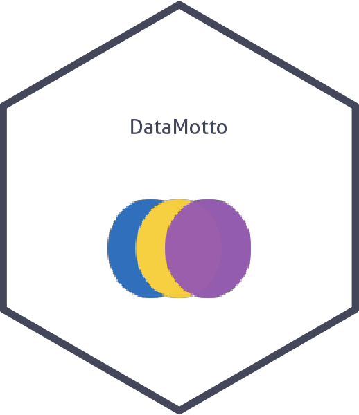
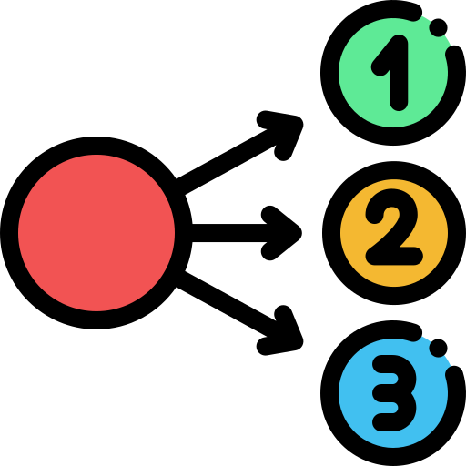

# DataMotto 

<!-- README.md is generated from README.Rmd. Please edit that file -->

<!-- badges: start -->

<!-- badges: end -->

DataMotto is a data science educational website formatted as an R-pkg, where users can learn, build, and share multilingual data skills efficiently. Putting minimality as the heart of DataMotto’s philosophy, we aim to build high-quality data resources in a conventional format called Dotto. The Dottos are developed based on the best practice coding and state-of-the-art packages to efficiently solve a data science problem. For each of Dotto’s problems, we develop the solutions in different popular programming languages that everyone can enjoy no matter what language they are comfortable with. The core languages we cover R, Python, Julia, SQL, and nodeJS.

## DataMotto Structure

 `Dot` > `Dotto` > `Line` > `Space` 

### Dotto: 
Dottos are the critical elements of DataMotto that aims to create dynamic modularized data science educational materials. They are self-explanatory, autonomous, multilingual data resources designed to be right to the point and solve a problem concisely. To clarify more, everyone can think of Dotto as a high-quality summary of an online course, an overview of a book chapter, a review of a package or group of packages, a technical summary of a paper, a real-world case study, Interview preparation materials, and many other scenarios.

### Dot: 

Dottos are composed of Dots, which are the smallest component of DataMotto. All Dots has three parts: Instruction, Code, and Result. Our conventional framework has some rules for creating Dots:

1. The Instruction part has a limit of 560 characters. They introduce briefly the problem, instruction, or other resources you may need to check

1. The Code part has a limit of 15 lines, including comments.

1. The Result part includes only one table, figure, or list. You may see an interpretation of the results here as well (up to 280 characters).

### Line: 

Considering DataMotto as a modularized platform with having Dottos as the building blocks, Dottos can team up, be connected together and create a Line that can cover a comprehensive concept in data science efficiently. As each line is created from (multilingual) Dottos, they are covering different programming language. Lines can be considered as a dynamic educational materials that their length may be altered in the future.

### Creating a Dotto

To create a Dotto, please check [this article](./articles/Creating_Dotto.html) that explains the technical structure of a Dotto and the process of creating a new Dotto or adding a new language to an existing Dotto.

## 🧨 Do you have an idea for a Dotto?

If you have a proposal for creating a new Dotto, you should fill out a [Dotto request](https://github.com/DataMotto/DataMotto/issues/new?assignees=ardeeshany&labels=Dotto+Request&template=dotto-request.md&title=). Then, we review your request, create a branch for you, and help you to build your Dotto and publish it on the [DataMotto](https://DataMotto.com) website.

## 🏎 Do you want to add a new language to an existing Dotto?

If you are willing to add a new language to an existing Dotto, you should fill out a [Language request](https://github.com/DataMotto/DataMotto/issues/new?assignees=&labels=Lang+Request&template=language-request.md&title=). Then, we review your request, get you to connect with the primary author(s), create a branch for you, and help you to upgrade the Dotto and update [DataMotto](https://DataMotto.com) website.
