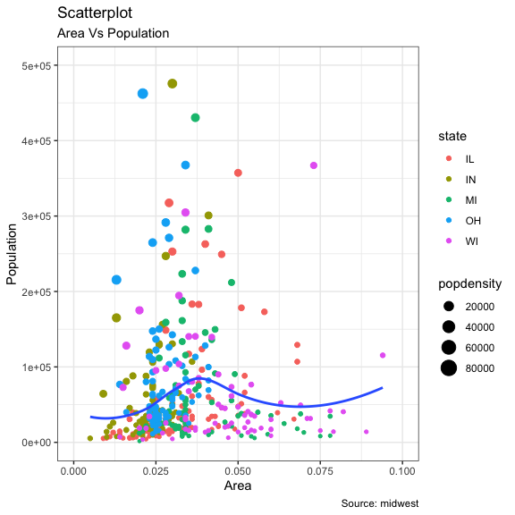
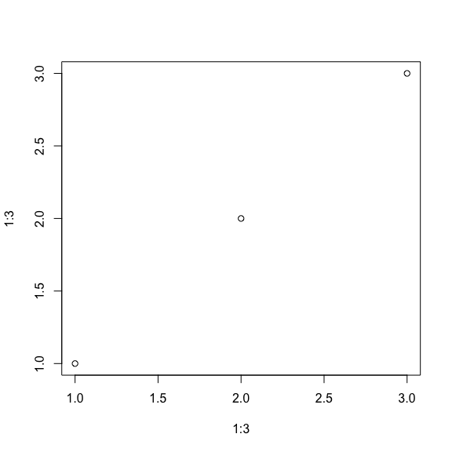

<li class="nav-item">
<a class="nav-link dm-dot-title">Report</a>
<div class="dm-dot-content">

Write your `Dotto` Here


```r
# heloo world
getwd()
```

```
## [1] "/Users/ardalanmirshani/rsites/Datamotto/inst/rmarkdown/templates/dotto/skeleton"
```

```r
library(ggplot2)
theme_set(theme_bw())  # pre-set the bw theme.
data("midwest", package = "ggplot2")
# midwest <- read.csv("http://goo.gl/G1K41K")  # bkup data source

# Scatterplot
gg <- ggplot(midwest, aes(x=area, y=poptotal)) + 
  geom_point(aes(col=state, size=popdensity)) + 
  geom_smooth(method="loess", se=F) + 
  xlim(c(0, 0.1)) + 
  ylim(c(0, 500000)) + 
  labs(subtitle="Area Vs Population", 
       y="Population", 
       x="Area", 
       title="Scatterplot", 
       caption = "Source: midwest")

plot(gg)
```

```
## `geom_smooth()` using formula 'y ~ x'
```

```
## Warning: Removed 15 rows containing non-finite values (stat_smooth).
```

```
## Warning: Removed 15 rows containing missing values (geom_point).
```


</div>
</li>

<li class="nav-item">
<a class="nav-link dm-dot-title">Summary</a>
<div class="dm-dot-content">

</div>
</li>
